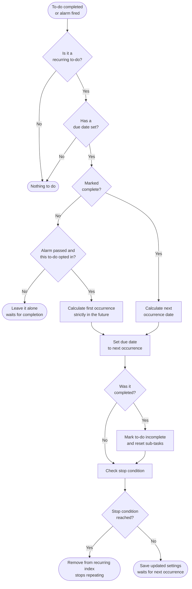
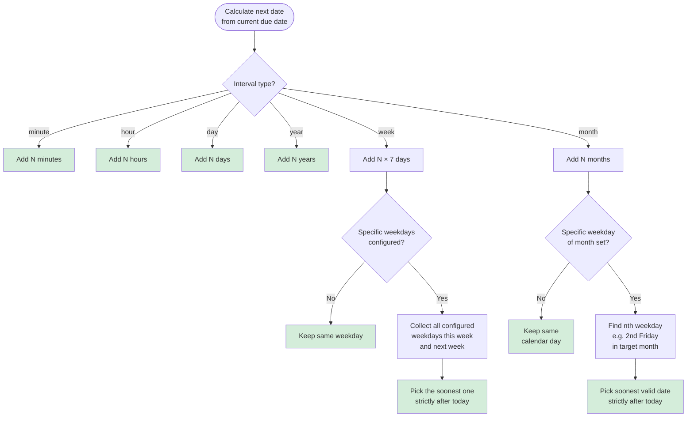
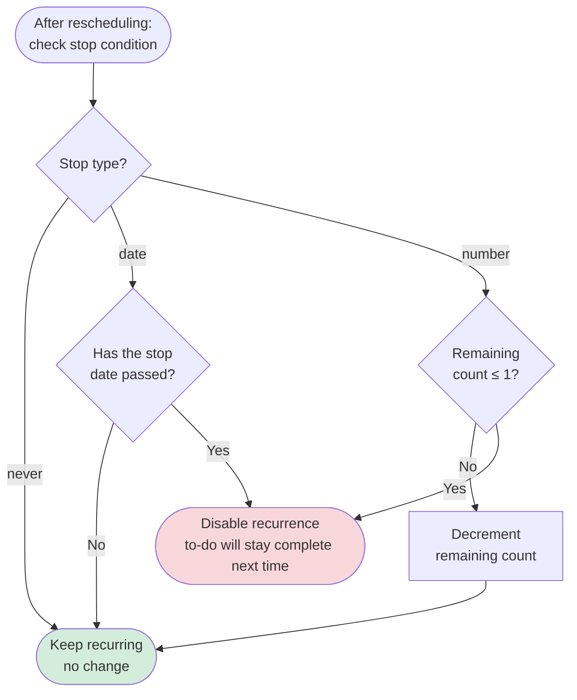
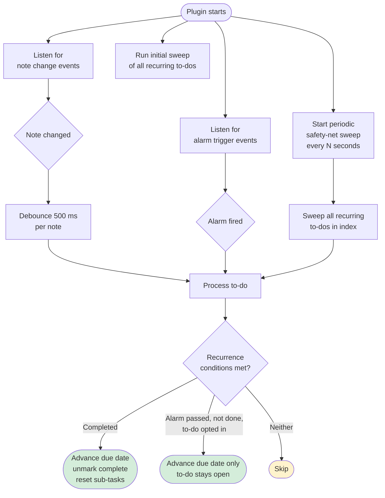

# Joplin Repeating To-Dos

A powerful and comprehensive plugin for to-do repetition/recurrence in [Joplin](https://joplinapp.org/).

**NPM:** https://www.npmjs.com/package/joplin-plugin-repeating-to-dos-v2

---

## Table of Contents

- [Overview](#overview)
- [User Guide](#user-guide)
  - [Installation](#installation)
  - [Setting Up a Recurring To-Do](#setting-up-a-recurring-to-do)
  - [Recurrence Options](#recurrence-options)
  - [Managing Overdue To-Dos](#managing-overdue-to-dos)
  - [Plugin Settings](#plugin-settings)
- [How It Works](#how-it-works)
  - [Scheduling Flow](#scheduling-flow)
  - [Next Date Calculation](#next-date-calculation)
  - [Stop Condition Logic](#stop-condition-logic)
  - [Event-Driven Architecture](#event-driven-architecture)
- [Developer Guide](#developer-guide)
  - [Project Structure](#project-structure)
  - [Getting Started](#getting-started)
  - [Building](#building)
  - [Testing](#testing)
  - [Architecture Overview](#architecture-overview)
  - [Contributing](#contributing)

---

## Overview

When a recurring to-do is marked complete, this plugin immediately resets the alarm date to the next recurrence and unmarks it as completed — so your to-do list is always up to date without any manual work. To-dos you *don't* get around to need not be left behind either: tick [one option](#resetting-the-alarm-without-completing-the-to-do) on a to-do and a passed alarm is simply re-armed on the next occurrence instead of sitting there overdue.

Supported recurrence intervals: **minute, hour, day, week, month, year**

Special scheduling options:
- **Weekly**: repeat on specific weekdays (e.g. Mon/Wed/Fri)
- **Monthly**: repeat on a specific weekday of the month (e.g. the second Friday, the last Tuesday)

Stop conditions: repeat **forever**, stop after **N repetitions**, or stop after a **specific date**.

---

## User Guide

### Installation

The plugin is available in the official Joplin plugin repository:

1. Open Joplin and go to **Tools → Options** (or **Joplin → Preferences** on macOS)
2. Select the **Plugins** section
3. Search for **"Repeating To-Dos"**
4. Click **Install** and restart Joplin when prompted

### Setting Up a Recurring To-Do

#### Step 1 — Open the recurrence dialog

On any note, click the recurrence icon in the note toolbar.


#### Step 2 — Enable recurrence

The recurrence dialog opens. Check the first checkbox to enable repeating for this to-do. Additional options appear once it is checked.


#### Step 3 — Set the interval

Choose how often the to-do repeats.


Set the multiplier (e.g. `2` with **hours** = every 2 hours, `3` with **days** = every 3 days).


#### Step 4 — Weekly: choose specific weekdays (optional)

When **weeks** is selected as the interval, you can pick which days of the week the to-do recurs on. Leaving all days unchecked repeats on the same weekday as the original alarm date.


#### Step 5 — Monthly: choose a weekday of the month (optional)

When **months** is selected, you can specify a particular weekday of the month (e.g. the first Sunday, the last Wednesday). Leaving this unset repeats on the same calendar date each month.


#### Step 6 — Set a stop condition

**Never** — repeats indefinitely (default)


**After N times** — stops after a fixed number of completions


**After a date** — stops once that date has passed


#### Step 7 — Save

Click **OK** to save. The recurrence is now active. It reschedules automatically the next time you mark the to-do complete — or, if you ticked **Move the alarm on even when this To-Do is not done** for this to-do, the next time its alarm passes without it being done.

---

### Managing Overdue To-Dos

Access these options from **Tools → Repeating To-dos**:

| Menu item | What it does |
|---|---|
| **Update All Recurrence Information** | Manually re-scans every recurring to-do and advances any that were missed |
| **Update Overdue To-Dos** | Marks overdue to-dos complete and rolls their due date forward to the next occurrence past today |
| **Reschedule Overdue To-Dos to Today** | Keeps the to-dos open but moves their due date to today (preserving the original time-of-day) |

> To-dos that have **Move the alarm on even when this To-Do is not done** ticked are already moved
> on automatically, so for those these commands are mostly a manual nudge. Note that *Reschedule
> Overdue To-Dos to Today* can land on a time that has already passed today, in which case the next
> automatic reset moves such a to-do on again.

### Plugin Settings

Go to **Tools → Options → Repeating To-dos** to configure:

| Setting | Default | Description |
|---|---|---|
| Update frequency (seconds) | 30 | How often the safety-net sweep checks for missed recurring to-dos |
| Enable debug logging | Off | Writes detailed trace output to the developer console |

There is deliberately no global switch for the alarm-reset behaviour below: it is set per to-do in
the recurrence dialog, so turning it on for one to-do never changes any of the others.

#### Resetting the alarm without completing the to-do

**Move the alarm on even when this To-Do is not done** is an option on each individual to-do, in the
recurrence dialog, and it is **off by default**. Off, a repeating to-do behaves like any other
to-do: once its alarm passes it stays overdue until you tick it off.

Tick it for a to-do and, when its alarm passes while the to-do is still open, the plugin skips that
occurrence and re-arms the alarm on the next one — so a "water the plants every day" reminder pops
up again tomorrow instead of sitting overdue forever. Only the to-dos you tick it on are affected.

On the reset path the plugin deliberately does **less** than it does on completion:

| | Completed | Alarm reset (not done) |
|---|---|---|
| Due date / alarm moves to the next occurrence | ✅ | ✅ |
| To-do is re-opened | ✅ | — (it was never closed) |
| Sub-tasks are reset to unchecked | ✅ | — (your progress is kept) |
| Counts against an "after N times" stop condition | ✅ | ✅ |

If several occurrences were missed — Joplin was closed over the weekend, say — the to-do is skipped
forward far enough that the new alarm always lands in the future. Missed alarms are caught by the
alarm event when Joplin is running, and by the safety-net sweep on startup when it was not.

Leave the option unticked — the default, including for every recurrence created before the option
existed — to keep the plain behaviour, where an overdue to-do stays overdue until you complete it.

---

## How It Works

### Scheduling Flow

Two things move a recurring to-do on to its next occurrence: completing it, or — for a to-do with
**Move the alarm on even when this To-Do is not done** ticked — its alarm passing while it is still
open.

When you mark a recurring to-do as complete, the plugin immediately:

1. Looks up the recurrence settings for that note
2. Calculates the next due date
3. Updates the alarm date to the next occurrence
4. Marks the to-do as incomplete again
5. Resets any sub-tasks to incomplete
6. Checks whether the stop condition has been reached

When an alarm passes on a to-do you have not done, steps 4 and 5 are skipped: the to-do stays open
and keeps its sub-task progress, and only the alarm is moved forward.



---

### Next Date Calculation

The next due date depends on the chosen interval. For weekly and monthly intervals, extra logic finds the correct weekday.



---

### Stop Condition Logic

After each rescheduling, the plugin checks whether the to-do should ever recur again.



---

### Event-Driven Architecture

The plugin does not rely on polling alone. It reacts to Joplin events in real time, with a periodic sweep as a safety net for any missed events.



**Storage**: recurrence settings are stored in Joplin's note `userData` API (synced across devices). The `recurring` tag is maintained as a fast query index so the plugin can find all recurring notes without scanning every note.

---

## Developer Guide

### Project Structure

```
src/
├── index.ts                  # Plugin entry point — wires everything together
├── manifest.json             # Plugin metadata
├── core/
│   ├── commands.ts           # Registers Joplin commands (toolbar / menu actions)
│   ├── database.ts           # RecurrenceStore — reads/writes recurrence via userData API
│   ├── decorators.ts         # @Trace and @TryCatch method decorators
│   ├── joplin.ts             # Thin wrapper around the Joplin data API
│   ├── misc.ts               # Shared utility functions
│   ├── recurrence.ts         # RecurrenceManager — core scheduling logic
│   ├── settings.ts           # SettingsManager — plugin settings registration
│   └── timer.ts              # RecurrenceScheduler — event listeners + safety-net sweep
├── gui/
│   ├── dialog/
│   │   ├── dialog.ts         # Dialog host-side logic (open/close, result handling)
│   │   ├── dialog.html       # Dialog UI markup
│   │   ├── dialog.css        # Dialog styles
│   │   └── dialog_addon.js   # Dialog webview-side JS (runs inside the dialog iframe)
│   ├── menu.ts               # Tools menu registration
│   └── toolbar.ts            # Note toolbar button registration
└── model/
    └── recurrence.ts         # Recurrence class + serialization helpers
```

### Getting Started

1. **Fork** the repository on GitHub
2. **Clone** your fork

```bash
git clone https://github.com/<your-username>/joplin-repeating-todos-plugin.git
cd joplin-repeating-todos-plugin
```

3. **Install dependencies**

```bash
npm install
```

4. **Open** the project in VS Code (or VSCodium)

### Building

Compile TypeScript and bundle the plugin:

```bash
npm run dist
```

- Compiled output goes to `/dist`
- The installable `.jpl` plugin file is written to `/publish`

### Testing

Run the unit test suite:

```bash
npm test
```

Tests live in `test/` and use Jest. The test configuration is in `jest.config.js` and `tsconfig.test.json`.

For integration testing, launch Joplin in development mode and load the plugin from the `/publish` folder as a development plugin:

```bash
/path/to/joplin --env dev
```

In Joplin dev mode: **Tools → Options → Plugins → Manage your plugins → Install from file**, then select the built `.jpl`.

Enable **debug logging** in **Tools → Options → Repeating To-dos** to see detailed trace output in the developer console (**Help → Toggle Developer Tools**).

### Architecture Overview

| Class | Responsibility |
|---|---|
| `RecurrenceStore` | Reads/writes recurrence settings to Joplin's `userData` API per note; maintains the `recurring` index tag |
| `RecurrenceManager` | Core logic: processes a completed to-do (or a passed alarm on an open one), computes the next date, advances the alarm, handles overdue scenarios |
| `RecurrenceScheduler` | Wires up `onNoteChange` and `onNoteAlarmTrigger` Joplin events; runs a periodic safety-net sweep |
| `SettingsManager` | Registers the plugin settings section and restarts the scheduler when settings change |
| `CommandManager` | Registers the four Joplin commands exposed in the toolbar and menu |
| `Recurrence` (model) | Holds all recurrence fields; implements `getNextDate`, `getNextDateAfter`, `updateStopStatus` |

**Key design decisions:**
- Advancement is **event-driven** (note change / alarm), not purely polling — this means the to-do advances the moment it is checked off, or the moment its alarm fires, not at the next sweep interval
- The safety-net sweep (default every 30 s) catches anything the event listeners may have missed (e.g. a completion that happened while Joplin was closed)
- Recurrence data is stored in `userData` (not in the note body) so it survives note edits and syncs cleanly across devices
- Legacy YAML frontmatter from older plugin versions is automatically migrated to `userData` on first access

### Contributing

1. Create a branch from `main` for your feature or fix
2. Make your changes and add or update tests where relevant
3. Run `npm run dist` to verify the build succeeds and `npm test` to verify tests pass
4. Open a pull request against `main` with a clear description of the change

---

## Tags

`joplin-plugin-repeating-to-dos-v2` `joplin-plugin`
